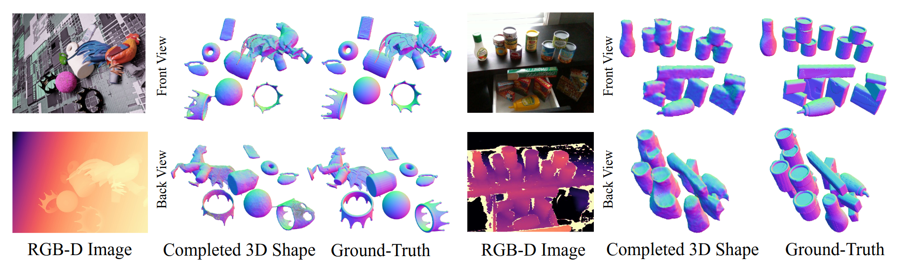

# Zero-Shot Multi-Object Scene Completion (ECCV 2024)



**Zero-Shot Multi-Object Shape Completion**<br>
[Shun Iwase](https://sh8.io/#/),
[Katherine Liu](https://www.thekatherineliu.com/),
[Vitor Guizilini](https://vitorguizilini.weebly.com/),
[Adrien Gaidon](https://adriengaidon.com/),
[Kris Kitani](https://kriskitani.github.io/),
[Rareș Ambruș](https://www.tri.global/about-us/dr-rares-ambrus),
[Sergey Zakharov](https://zakharos.github.io/)<br>
**[Paper](https://arxiv.org/abs/2403.14628), [Project Page](https://sh8.io/#/oct_mae)**


## Abstract

We present a 3D scene completion method that recovers the complete geometry of multiple unseen objects in complex scenes from a single RGB-D image. Despite notable advancements in single-object 3D shape completion, high-quality reconstructions in highly cluttered real-world multi-object scenes remains a challenge. To address this issue, we propose OctMAE, an architecture that leverages an Octree U-Net and a latent 3D MAE to achieve high-quality and near real-time multi-object scene completion through both local and global geometric reasoning. Because a naive 3D MAE can be computationally intractable and memory intensive even in the latent space, we introduce a novel occlusion masking strategy and adopt 3D rotary embeddings, which significantly improves the runtime and scene completion quality. To generalize to a wide range of objects in diverse scenes, we create a large-scale photorealistic dataset, featuring a diverse set of 12K 3D object models from the Objaverse dataset which are rendered in multi-object scenes with physics-based positioning. Our method outperforms the current state-of-the-art on both synthetic and real-world datasets and demonstrates a strong zero-shot capability.

## News
- 2024-07-01: OctMAE is accepted by ECCV 2024

## Prerequisites
- Docker
- [Pigz](https://zlib.net/pigz/)
- [AWS CLI](https://docs.aws.amazon.com/cli/latest/userguide/getting-started-install.html)

## Environment Setup

### Build a docker image

```
$ git clone --recursive git@github.com:TRI-ML/OctMAE.git
$ cd OctMAE
$ ./docker/build.sh
```

### Run a docker image

```
$ ./docker/run.sh
```

## Dataset Preparation

Note that our training and evaluation datasets have 20TB and 22GB of data respectively and is assumed to be stored in an S3 bucket. Since [Webdataset](https://github.com/webdataset/webdataset) is used for training and evaluation, you need to download, unzip, and re-upload the shard files to your own S3 bucket. **Do not forget to replace `{your_s3_path}` in `configs/default.yaml` and `eval.py` with your S3 path.** You can also download a tiny version of the training dataset (the first 10 shards of the training dataset) with `train_tiny` for visualization purposes.

```
# Download, unzip, and re-upload the shard files.
$ ./scripts/download.sh {your_data_path} {train_tiny|train|eval}
$ ./scripts/upload.sh {your_data_path} {train|eval} {your_s3_path}
```


## Quickstart

### Training

```
# From scratch
$ ./scripts/train.sh {your_wandb_project_name} {your_wandb_run_name} ./configs/default.yaml

# From a checkpoint
$ ./scripts/train.sh {your_wandb_project_name} {your_wandb_run_name} ./configs/default.yaml {path_to_checkpoint_file}
```

### Evaluation
- Download a pre-trained checkpoint
```
$ mkdir checkpoints
$ wget https://s3.amazonaws.com/tri-ml-public.s3.amazonaws.com/github/octmae/octmae.ckpt -P checkpoints/
```
- Run evaluation
```
$ ./scripts/eval.sh ./configs/default.yaml checkpoints/octmae.ckpt {eval_dataset_name (synth_eval, ycb_video, hb, hope)}
```

### Visualizations
COMING SOON!

### Demo
COMING SOON!

## Citation
```
@InProceedings{Iwase_ECCV_2024,
  author = {Iwase, Shun and, Liu, Katherine and Guizilini, Vitor and Gaidon, Adrien and Kitani, Kris and Ambruș, Rareș and Zakharov, Sergey},
  title = {Zero-Shot Multi-Object Scene Completion},
  booktitle = {ECCV},
  year = {2024}
}
```

## License
This repository is released under the [CC BY-NC 4.0](https://github.com/TRI-ML/OctMAE/blob/main/LICENSE.md) license.
